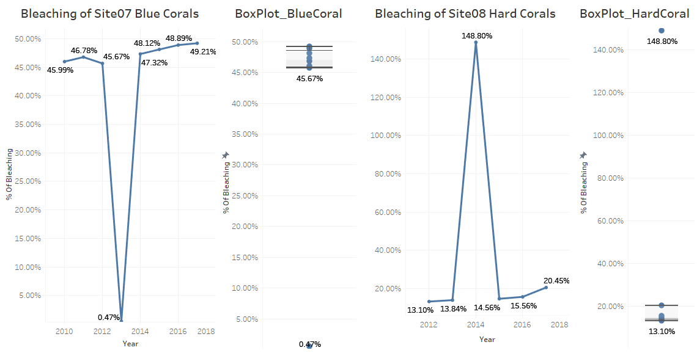
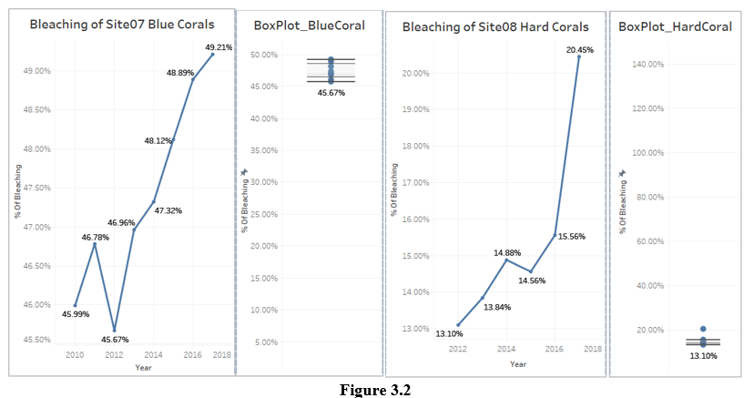

## OJECTIVE:-

To perform any reformatting/wrangling, checking and cleaning on the coral bleaching data for 8 sites in the Great Barrier Reef for different kinds of corals over last 8 years in order to determine the worst coral bleaching and how the location affects bleaching on different kinds of coral by supporting reasons with the help of data exploration using Tableau visualizations.  

## 1. INTRODUCTION

The following report explains the transforming of data for a valuable purpose such as data analytics, which uses visual exploration to describe the characteristics of the dataset. The goal of the report is to visualize the data to determine answer the questions to be followed in the data exploration section of this report. 

The dataset consists of eight sites in the Great Barrier Reef and gives the percentage of bleaching for different coral types namely: hard corals, soft corals, sea pens, sea fans and blue corals respectively over a period of 8 years from 2010 to 2017. 

## 2. Data WRANGLING

### Challenges with original dataset (Data Structure):

#### i) The data is not represented as individual observations and attributes:
This original data set violates the principles of tidy data (Wickham, 2014) i.e., from a single observation it is difficult to describe the characteristics of each coral type and the percentage of bleaching for any given year. As shown in the figure1.1 the observations for site01 displays the characteristics for both corals and sea fans as a result it will be difficult to visualize them as separate data in Tableau Public.

Hence, for accuracy of statistical analysis it is necessary to visualize dataset into a standard format of rows and columns.

### Figure 2.1

#### ii)  Column headers are values, not variable names:
the variables 2017, 2016, 2015 etc. form both the rows and column as shown in figure2.2 and similarly with coral types: soft corals, sea fans etc. Thus, the representation and visualization of this data can make the computation difficult

### Figure 2.2

To better reflect the roles of 2017, 2016 etc. and each coral type in the dataset, the variable column is renamed to ‘Year’ and ‘Types of Coral’ respectively as shown in figure2.3. Hence, representing in this format determines each dataset unit as a combination of % of bleaching and Type of Coral.

### Figure 2.3

#### iii) Long format over wide format:
Figure2.2 represents the wide format of the dataset and figure2.3 represents the long format respectively. In the long format when the occasion (Year in this case) is the unit of analysis, we can use each Year’s ‘Site Name’ as a covariate for same Year’s % of bleaching value. In the wide format, when the unit of observation is ‘Site Name’, there is no way to do this. This implies we can use any of the Site Names as covariates for all years, but not Year-specific covariates.

## 3. CLEANING INCORRECT DATA

### 3.1 Identifying the Outliers:

The two outlier (% of bleaching) identified within the given data is shown below in figure3.1 which is represented by a line graph and box plot of the data to spot the outliers visually. The outliers can thus skew the interpretation of the data. The 

The outliers in this case are not ignored and are corrected to ensure that the data interpretation is as accurate as possible, with an assumption that the decimal point placement was captured incorrectly within the dataset. The outliers were corrected to ‘46.96%’ (two decimal points) for Site07 blue corals (2013) and ‘14.88%’ (one decimal point) for Site08 hard corals (2014). The after transformation of outliers is as shown below in the figure 3.2. 

### 3.2 Null values:
The null values (% of bleaching) contribute to 30% of the total values (% of bleaching). The null values can mean a zero value or an error in capturing the values. This case ignores the null values and does not consider these null values into statistical analysis of the data exploration. 

### 3.3 Correction of latitude coordinate: 
The dataset also includes the longitude and latitude coordinates of the Great Barrier reef which is located off the coast of Queensland in northeastern Australia (Claudino-Sales, 2019). The coordinates given in the original dataset when plotted across the symbol map on Tableau Public, points the ‘Site02’ location far away from northeastern coast as shown in the figure3.3(a). On observing the coordinates provided in the original data shows that there is a manipulation of sign in the latitude value of ‘Site02’ as shown in figure3.3(b). 

To fix this error the sign is changed to negative for the latitude coordinates of ‘Site02’ and re-plotted to map the exact location of Great Barrier Reef as shown in figure3.3(c) in the world map. 

## 4. DATA EXPLORATION

The data is explored and visualized using Tableau Public, and then analyze the dataset thus formatted using the methods and techniques explained in section 2 and 3 of this report. The data thus explored will answer the two questions in the following sections. 

### 4.1 Exploring formatted data using Tableau Public:

The formatted data is imported into Tableau Public as an excel file type. The dataset includes both the categorical data (Types of Coral, Site Name) and numeric data (%of bleaching, Latitude, Longitude). To find the answer to the questions we need to analyze the relationship between categorical variables (Type of Coral) as well as the continuous variables(% of bleaching). The row contains ‘% of bleach’ and ‘Type of Coral’ variables that varies across the year variable in column as show in the figure4.1(a). This view is further nested to display variation in bleaching for each coral type across all the years (2010–2017). Each coral type is identified by a specific color as represented in the legend shown in the footer of the graph. The average of the ‘% of bleaching’ is computed as the sample dataset is not large and symmetrically distributed and gives a better measure of central tendency than median and that the outliers have been fixed.

The graph is an area chart representation of the bleaching of corals for a period of 2010 to 2017 and shows the effect of bleaching on each coral type for each year. 

The second graph as shown in figure4.1(b) is a symbol map which shows the % of bleaching as a function of site. The legend below the graph explains the color schema where the depth of the color increases with increase in % bleaching with respect to each site respectively. The lowest value of % of bleaching as indicated on legend is 27.64% and the highest value is 45.34%.

#### Q1) In which years and for which kinds of coral bleaching is the worst?

The figure 4.1(a) shows the % of bleaching for each year and each coral type. For instance, for the year 2010 shows blue corals had the highest effect of bleaching at 34.91% followed by Sea fans at 34.50% indicated by the colors corresponding to legend. The year 2011 had severe effects of bleaching on sea fans at 35.73%. Similarly, we can make observations of bleaching for each year. 

#### _Answer: “On the whole we can conclude that 2010 and 2012 had worst bleaching effects on blue corals. 2011, 2013 and 2017 was worst for Sea fans and 2016 was worst for Soft corals”.

#### Q2) How the location of the site affects bleaching on the different kinds of coral?

The depth of the color in the legend below symbol map (figure 4.1b) indicates how prevalent the bleaching is with respect to individual sites, depth of color increases with increase in % of bleaching. 

#### _Answer: “The corals on far north sites i.e. Site01, Site05 and Site07 see worst bleaching compared to the central Sites – Site06, Site08 and far south sites – Site02 and Site04.Also, it can be observed that the coral reef nearer to the coast (Sites 01, 05, 07, 08 and 06) suffer worst bleaching compared to the ones away from the coastline – Site03 and Site04”. 

### References: 

1.	Claudino-Sales, V. (2019). Great Barrier Reef, Australia. In Coastal World Heritage Sites (pp. 289-295): Springer.
1. 	Wickham, H. (2014). Tidy data. Journal of Statistical Software, 59(10), 1-23. 

